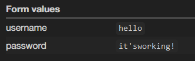

# Let's Go Phishing

This is a fake login page acting like BeCode's Moodle. Using [Webhook](https://webhook.site/#!/) I can intercept the credentials entered.

[Link to view the login page](https://maurvan.github.io/phishing_becode/)